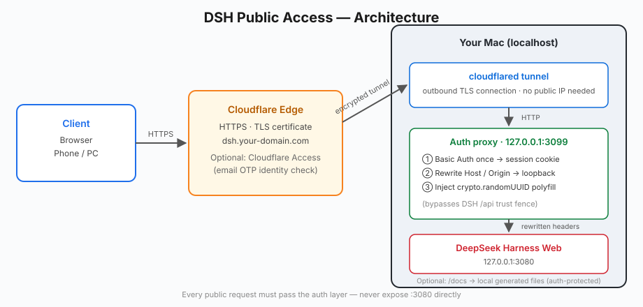
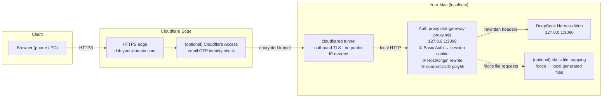

# DSH Public Access — Securely Expose the DeepSeek Harness Web GUI

**[English](README.en.md) | [中文](README.md)**

Serve the **DeepSeek Harness Web GUI** — an agent console that by default listens only on `127.0.0.1:3080` — over the public internet on your own domain, reachable from **any device (including phones)**, with **boot-time auto-start**.

> ⚠️ Security first: behind this GUI is a **full agent console that can execute arbitrary commands and read/write any file (equivalent to remote code execution)**. This project **never exposes a bare port** — every public entry must pass an authentication layer.

## Architecture





Three macOS launchd services provide **auto-start at login + crash recovery**: `com.dsh.web` / `com.dsh.proxy` / `com.dsh.tunnel`.

## Why this setup (lessons learned)

| # | Symptom | Root cause | How this project handles it |
|---|---|---|---|
| 1 | Page loads but no history / workspace data | DSH runs every `/api` request and WebSocket through a **Host trust fence** (DNS-rebinding / cross-site defense) that only accepts loopback Hosts — tunnel hostnames get 403 | The proxy rewrites Host/Origin to the loopback authority |
| 2 | White screen; JS returns 200 but 0 bytes | The install lived inside an OneDrive-synced folder; files were **cloud placeholders**, and DSH silently served empty bodies on failed reads | Move DSH out of sync folders; or force files to materialize locally |
| 3 | Login dialog loops forever | Browsers don't attach cached Basic Auth credentials to every subresource / WebSocket | The proxy switches to **cookie-session auth** after the first Basic Auth |
| 4 | `crypto.randomUUID is not a function` on old mobile browsers | API only exists in Chrome/Edge 92+ (2021) | The proxy injects a `crypto.randomUUID` polyfill into HTML |
| 5 | Cannot "add workspace" remotely | On macOS DSH always uses the **native dialog** directory picker, invisible to remote browsers | Launch DSH with `SSH_CONNECTION=1` to force the in-browser browse picker |
| 6 | After upgrading to 0.1.5 the public URL only shows `dsh web authentication required` | The new version generates a **one-time launch token** per start; the only entry is `/?token=…`, and all previous cookies are invalidated | The proxy reads the current token from the startup log and **retries on 401 with it** (transparent to the browser) |
| 7 | Page turns into mojibake / white screen with binary bytes in the source | DSH compresses HTML according to `Accept-Encoding`, while the proxy injects a polyfill into HTML — **concatenating into a compressed stream corrupts it** | The proxy requests identity encoding upstream (drops `Accept-Encoding`) and skips injection on compressed responses |

## Quick start

### Prerequisites

- A domain, added to a **free** Cloudflare account (**full-zone NS setup**; Cloudflare's free plan does not support delegating only a subdomain)
- macOS + Homebrew; `node` and `cloudflared` installed
  ```bash
  brew install node cloudflared
  ```
- DSH itself runs fine (`dsh web` listening on 127.0.0.1:3080)

### Steps

1. **Log in to cloudflared and create a tunnel** (opens a browser to authorize your Cloudflare account and domain):
   ```bash
   cloudflared tunnel login
   cloudflared tunnel create dsh
   ```

2. **Configure the auth proxy** (strong password — the sole credential for public access):
   ```bash
   # try it out
   AUTH_USER=you AUTH_PASS='a-very-strong-password' node proxy/dsh-gateway-proxy.mjs
   ```

3. **Configure the tunnel**: copy `cloudflared/config.example.yml` to `~/.cloudflared/config.yml` and replace the tunnel ID, username and domain; the `ingress` must point at `http://127.0.0.1:3099` (the proxy).

4. **Create the DNS route and start**:
   ```bash
   cloudflared tunnel route dns dsh dsh.your-domain.com
   bash scripts/start-public.sh
   ```

5. **(Strongly recommended) add Cloudflare Access**: Zero Trust → Access → Applications, add an "only my email" policy for `dsh.your-domain.com` — a second identity layer at the Cloudflare edge.

6. **Auto-start on boot**: replace the placeholders in `launchd/*.plist`, then:
   ```bash
   bash scripts/switch-to-autostart.sh   # stop manual processes → load 3 services → verify
   ```

7. **Verify**:
   ```bash
   curl -s -u you:password -o /dev/null -w '%{http_code}' https://dsh.your-domain.com/   # 200
   curl -s -o /dev/null -w '%{http_code}' https://dsh.your-domain.com/                  # 401 (rejected without credentials)
   ```

## Public static file mapping (optional)

The proxy ships an optional **static file mapping**: expose a local directory (e.g. "locally generated documents / artifacts") through the public domain, **behind the same authentication**. Handy for sharing generated reports, PDFs or Markdown docs with people who already have access.

Enable it by setting `DOCS_ROOT` (the feature is fully off when unset):

```bash
AUTH_USER=you AUTH_PASS='a-very-strong-password' \
DOCS_ROOT=/Users/you/documents \
DOCS_PREFIX=/docs \
DOCS_TITLE='My Docs' \
node proxy/dsh-gateway-proxy.mjs
```

- `https://dsh.your-domain.com/docs/` → auto-generated directory listing (hides dotfiles)
- `https://dsh.your-domain.com/docs/<file>` → download or preview
  - `.pdf` renders inline in the browser; `.md/.txt/.html/.json/.csv` display directly; everything else downloads as an attachment
  - Built-in MIME map: md/pdf/html/json/txt/csv/images/zip/docx/xlsx/pptx
- Security: requests must pass the same Basic/Cookie auth first (401 otherwise); built-in **path-traversal protection** (resolved path must stay inside `DOCS_ROOT`, 403 otherwise); UTF-8 filenames are handled

> Note: everything inside the mapped directory is downloadable from the internet (auth-protected only). Share only what you intend to share — never map your whole home directory.

## DSH 0.1.5+ launch token handling

Since 0.1.5, every `dsh web` start generates a **one-time launch token** and prints it in the startup log:

```
dsh web: http://127.0.0.1:3080/?token=<random>
```

- The only entry point is the URL carrying `?token=`: it exchanges the token for a signed session cookie (valid 30 days), after which the cookie authenticates
- Without the token (or with a cookie invalidated by a restart) the page only shows `dsh web authentication required; reopen the URL printed by dsh web.`
- The token is **random per process and cannot be pinned**; restarts and internal reloads rotate it

How the proxy handles it: **on an upstream 401 it reads the current token from the log and retries once with `?token=`**, completing the 303 → Set-Cookie exchange on the browser's behalf. As a result:

- `https://dsh.your-domain.com/` just works — no manual token URL, no bookmark updates
- After a DSH restart rotates the token, the next visit silently re-exchanges for a fresh cookie

Relevant environment variable:

| Variable | Default | Meaning |
|---|---|---|
| `DSH_WEB_LOG` | `/tmp/dsh-web.log` | Path to the `dsh web` startup log (the proxy reads the current token from it) |

> If `dsh web` is not started via launchd and logs elsewhere, point `DSH_WEB_LOG` at the real file.

## Security notes (please read)

- **The auth layer is the only gate**: Basic Auth (or Cloudflare Access) is the entire barrier in front of DSH. Use a strong password, never share it, and inject `AUTH_PASS` only via environment variables / launchd plists — **never commit it to git**.
- A **double layer** is recommended: Cloudflare Access (email OTP) + proxy password.
- DSH's `/api` trust fence is intentionally bypassed by the proxy's header rewrite — the proxy takes over authentication. **Never remove the proxy and expose the port directly.**
- The proxy only listens on `127.0.0.1`; the only public entry is the Cloudflare edge + authentication.

## Notes for users in mainland China

- **Cloudflare's free plan only supports full-zone setup** (change the apex domain's NS); subdomain delegation / CNAME (partial) setup is an Enterprise feature.
- Keep apex-domain records **gray-cloud (DNS only)** — no Cloudflare proxy in front of them, so mainland resolution is barely affected; ICP-filed mainland sites are unaffected (ICP is bound to domain + hosting provider, not the DNS provider).
- If the apex domain has DNSSEC enabled, disable it before switching NS.
- GitHub / Cloudflare resources are slow or blocked from time to time; for GitHub release downloads use an accelerator prefix (e.g. `ghfast.top`, `gh-proxy.com`) in front of the original URL. For `git push`, set `HTTPS_PROXY` to a local proxy if you have one.
- On phones prefer a system browser; in-app WebViews (WeChat etc.) are often old — this project ships a `crypto.randomUUID` polyfill as a fallback.

## File layout

```
README.md / README.en.md     Chinese / English docs
docs/architecture.svg        architecture diagram (SVG)
proxy/dsh-gateway-proxy.mjs  auth proxy (cookie session + Host/Origin rewrite + polyfill + optional /docs file mapping) — the only "business code"
cloudflared/config.example.yml  Cloudflare tunnel config template
launchd/*.plist              three macOS launchd services (DSH / proxy / tunnel)
scripts/start-public.sh      start proxy + tunnel in one shot
scripts/switch-to-autostart.sh  manual → launchd switch + auto-verify
```

## Troubleshooting

- **401 / login loop on the index page** → is the proxy running (`lsof -iTCP:3099`)? Retry in an incognito window.
- **Page 200 but no data** → make sure the tunnel `ingress` points to 3099 (the proxy), not 3080.
- **White screen / 0-byte assets** → check whether the DSH install directory contains cloud placeholders (`stat -f "%b" file` → 0 blocks means placeholder); move DSH out of OneDrive/iCloud-synced folders.
- **WebSocket won't connect** → `curl --http1.1 ... -H "Upgrade: websocket"` should return 101; a 401 means the auth layer is blocking the upgrade. Note the **0.1.5 WS path is `/api/remote.mux`** (0.1.1 used `/api/events.mux`) — a wrong path yields 502.
- **Page shows `dsh web authentication required`** → the proxy should retry with the token automatically. If it still appears, verify the `DSH_WEB_LOG` file really contains `?token=…` (`grep -o 'token=[A-Za-z0-9_-]*' /tmp/dsh-web.log | tail -1`) and restart the proxy.
- **Mojibake / binary bytes in the page source** → DSH's compression collides with polyfill injection; this proxy avoids it by dropping upstream `Accept-Encoding` — check that if you modified the code.
- **Tunnel error 530** → `cloudflared tunnel run dsh` is not running or the tunnel ID in `config.yml` doesn't match.
- **`/docs` won't open** → the proxy must be started with `DOCS_ROOT=...`; make sure the directory exists and is readable; expect a 401 first if not authenticated.
- Logs: `/tmp/dsh-web.log` `/tmp/dsh-proxy.log` `/tmp/dsh-tunnel.log`.

## License

MIT
