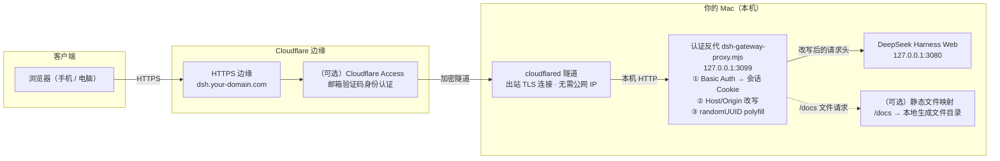

# DSH Public Access — DeepSeek Harness 公网安全访问方案

**[中文](README.md) | [English](README.en.md)**

让 **DeepSeek Harness Web GUI**（默认只监听 `127.0.0.1:3080` 的 Agent 控制台）可以通过你自己的域名，从**任意设备（含手机）安全地公网访问**，并支持开机自启。

> ⚠️ 安全第一：这个 GUI 背后是**能执行任意命令、读写任意文件的完整 Agent 控制台（等效 RCE）**。本方案默认**绝不裸奔端口**，公网入口必须套一层身份认证。

## 架构




三条 macOS launchd 服务实现**登录自启 + 崩溃自愈**：`com.dsh.web` / `com.dsh.proxy` / `com.dsh.tunnel`。

## 为什么要这套东西（踩坑实录）

| # | 症状 | 根因 | 本方案的处理 |
|---|---|---|---|
| 1 | 页面能开，但历史对话/工作区空白 | DSH 每个 `/api` 请求和 WebSocket 有 **Host 信任围栏**（防 DNS 重绑定/跨站），只认回环 Host，隧道域名被 403 | 反代把 Host/Origin 改写为回环地址 |
| 2 | 白屏，JS 返回 200 但 0 字节 | 安装目录在 OneDrive 同步文件夹，文件被**云占位**，DSH 读取失败静默返回空包 | 把 DSH 移出同步目录；或强制文件落地 |
| 3 | 反复弹登录框"登录个没完" | 浏览器不会把 Basic Auth 凭据自动附加到所有子资源/WebSocket | 反代改为 **Cookie 会话认证** |
| 4 | 老手机浏览器报 `crypto.randomUUID is not a function` | API 版本过老（Chrome/Edge 92+ 才有） | 反代向 HTML 注入 polyfill |
| 5 | 远程无法"添加工作区" | macOS 上 DSH 固定用**原生目录弹窗**选择器，远程浏览器看不到 | 用 `SSH_CONNECTION=1` 启动 DSH，切换为网页浏览式选择器 |
| 6 | 升级 0.1.5 后公网打不开，提示 `dsh web authentication required` | 新版每次启动生成**一次性 launch token**，唯一入口是 `/?token=…`，旧登录 Cookie 全部作废 | 反代读取启动日志里的当前 token，遇 401 **自动带 token 重试**（对浏览器透明） |
| 7 | 页面变乱码/白屏，源码里混着二进制 | DSH 按 `Accept-Encoding` 压缩 HTML，而反代要往 HTML 注入 polyfill，**压缩流被拼接破坏** | 反代向上游索取未压缩内容（删除 `Accept-Encoding`），压缩响应则放弃注入 |

## 快速开始

### 前置条件

- 一个域名，并已在 Cloudflare 免费账号接入（**整域 NS 接入**；Cloudflare 免费档不支持只委派子域）
- 本机 macOS + Homebrew；已安装 `node`、`cloudflared`
  ```bash
  brew install node cloudflared
  ```
- DSH 本体可正常运行（`dsh web` 监听 127.0.0.1:3080）

### 步骤

1. **登录 cloudflared 并建隧道**（会打开浏览器授权你的 Cloudflare 账号和域名）：
   ```bash
   cloudflared tunnel login
   cloudflared tunnel create dsh
   ```

2. **配置反代**（强密码，公网访问的唯一凭证）：
   ```bash
   # 试运行
   AUTH_USER=you AUTH_PASS='超强密码' node proxy/dsh-gateway-proxy.mjs
   ```

3. **配置隧道**：复制 `cloudflared/config.example.yml` 到 `~/.cloudflared/config.yml`，替换隧道 ID、用户名、域名；`ingress` 指向 `http://127.0.0.1:3099`（反代）。

4. **建 DNS 路由 + 启动**：
   ```bash
   cloudflared tunnel route dns dsh dsh.your-domain.com
   bash scripts/start-public.sh
   ```

5. **（强烈推荐）叠加 Cloudflare Access**：Zero Trust → Access → Applications，为 `dsh.your-domain.com` 加"仅我的邮箱"策略，在 Cloudflare 边缘再做一道身份认证。

6. **开机自启**：替换 `launchd/*.plist` 里的占位符后：
   ```bash
   bash scripts/switch-to-autostart.sh   # 停手动进程 → 加载三服务 → 自动验证
   ```

7. **验证**：
   ```bash
   curl -s -u you:密码 -o /dev/null -w '%{http_code}' https://dsh.your-domain.com/   # 200
   curl -s -o /dev/null -w '%{http_code}' https://dsh.your-domain.com/              # 401（无凭据被拒）
   ```

## 静态文件外网映射（可选）

反代内置一个**静态文件映射**：把本地某个目录（比如"本机生成的文档/产物"）通过公网域名直接访问，**同样走前面的认证**。适合把生成好的报告、PDF、Markdown 文档随手分享给已登录的人。

启用方式（设置 `DOCS_ROOT` 即开启，不设置则完全关闭）：

```bash
AUTH_USER=you AUTH_PASS='超强密码' \
DOCS_ROOT=/Users/you/documents \
DOCS_PREFIX=/docs \
DOCS_TITLE='我的文档' \
node proxy/dsh-gateway-proxy.mjs
```

- `https://dsh.your-domain.com/docs/` → 目录列表页（自动生成，隐藏 `.` 开头文件）
- `https://dsh.your-domain.com/docs/<文件名>` → 文件下载/预览
  - `.pdf` 浏览器内联预览；`.md/.txt/.html/.json/.csv` 直接展示；其余按附件下载
  - 已内置常见 MIME：md/pdf/html/json/txt/csv/图片/zip/docx/xlsx/pptx
- 安全：请求同样必须先通过 Basic/Cookie 认证（未登录 → 401）；内置**路径穿越防护**（解析后必须仍在 `DOCS_ROOT` 内，越界 403）；文件名 UTF-8 处理

> 注意：映射的目录内容就是公网可下载的内容（仅需认证）。只放你想分享的文件，不要把整个家目录映射出去。

## DSH 0.1.5+ 的 launch token 适配

从 0.1.5 起，`dsh web` 每次启动都会生成一个**一次性 launch token**，并把它打印在启动日志里：

```
dsh web: http://127.0.0.1:3080/?token=<随机串>
```

- 唯一入口是带 `?token=` 的 URL：它换取一枚签名的会话 Cookie（30 天有效），之后靠 Cookie 鉴权
- 不带 token（或 Cookie 已随上次重启作废）时，页面只显示 `dsh web authentication required; reopen the URL printed by dsh web.`
- token **每个进程随机生成、无法固定**，重启/内部重载都会换

反代对此的处理：**上游返回 401 时，自动从日志里读取当前 token 并带 `?token=` 重试一次**，把这个 303 → Set-Cookie 的过程替浏览器走完。因此：

- 公网地址 `https://dsh.your-domain.com/` 直接可用，**不需要**手动拼 token、不需要更新书签
- DSH 重启换了新 token 后，第一次访问会自动重新换取 Cookie，无需人工干预

相关环境变量：

| 变量 | 默认 | 说明 |
|---|---|---|
| `DSH_WEB_LOG` | `/tmp/dsh-web.log` | `dsh web` 的启动日志路径（反代从中读取当前 token） |

> 若 `dsh web` 不是通过 launchd 启动、日志写在别处，请用 `DSH_WEB_LOG` 指到实际日志文件。

## 安全说明（务必读）

- **认证层是唯一防线**：本方案中 Basic Auth（或 Cloudflare Access）是访问 DSH 的全部门槛。密码必须强、不要外传；`AUTH_PASS` 只通过环境变量/launchd plist 注入，**不要写进 git**。
- 建议**双层**：Cloudflare Access（邮箱验证码）+ 反代密码。
- DSH 的 `/api` 信任围栏被反代改写绕过——这是有意的（反代承担了认证职责），但意味着**不要移除反代直接暴露端口**。
- 反代只监听 `127.0.0.1`；公网唯一入口是 Cloudflare 边缘 + 认证。

## 国内使用特别说明

- **Cloudflare 免费档只能整域接入**（改主域名 NS）；子域委派 / CNAME 接入是 Enterprise 付费功能。
- 主域名记录保持**灰云（DNS only）**，不经过 Cloudflare 代理，国内解析基本无感；有 ICP 备案的国内站点不受影响（备案绑的是域名+接入商，不是 DNS 商）。
- 改 NS 前如主域名开了 DNSSEC，需先关闭。
- 访问 Cloudflare 面板、下载 GitHub 资源较慢时，可参考：GitHub Release 下载加速镜像（`ghfast.top`、`gh-proxy.com` 前缀拼接原 URL）。
- 手机端建议用系统浏览器；微信等内置 WebView 版本较老（本项目已内置 randomUUID polyfill 兜底）。

## 文件说明

```
README.md / README.en.md     中文 / 英文方案文档
docs/architecture.svg        架构图（SVG，可直接引用）
proxy/dsh-gateway-proxy.mjs  认证反代（Cookie 会话 + Host/Origin 改写 + polyfill + 可选 /docs 文件映射），唯一"业务代码"
cloudflared/config.example.yml  Cloudflare 隧道配置模板
launchd/*.plist               三个 macOS 开机自启服务（DSH/反代/隧道）
scripts/start-public.sh       一键启动反代 + 隧道
scripts/switch-to-autostart.sh 手动 → launchd 自启切换 + 自动验证
```

## 故障排查

- **首页 401/登录框循环** → 检查反代是否在跑（`lsof -iTCP:3099`）；无痕窗口重试。
- **页面 200 但无数据** → 反代是否在链路中（隧道 ingress 必须指向 3099 而非 3080）。
- **白屏/资源 0 字节** → 检查 DSH 安装目录是否有云同步占位文件（`stat -f "%b" 文件` 为 0 即占位）；把 DSH 移出 OneDrive/iCloud 同步目录。
- **WebSocket 连不上** → `curl --http1.1 ... -H "Upgrade: websocket"` 应返回 101；若 401 说明认证层挡了升级请求。注意 **0.1.5 的 WS 路径是 `/api/remote.mux`**（0.1.1 是 `/api/events.mux`），路径写错会得到 502。
- **页面提示 `dsh web authentication required`** → 反代应已自动带 token 重试；若仍出现：确认 `DSH_WEB_LOG` 指向的日志里确实有 `?token=…`（`grep -o 'token=[A-Za-z0-9_-]*' /tmp/dsh-web.log | tail -1`），然后重启反代。
- **页面乱码 / 源码里混着二进制** → DSH 压缩响应与 polyfill 注入冲突；本反代通过删除上游 `Accept-Encoding` 规避，若你自行改过代码请检查这一点。
- **隧道 530** → `cloudflared tunnel run dsh` 未运行或 config.yml 的 tunnel ID 不匹配。
- **`/docs` 打不开** → 反代需以 `DOCS_ROOT=...` 启动；确认目录存在且可读；未登录会先弹 401。
- 日志：`/tmp/dsh-web.log` `/tmp/dsh-proxy.log` `/tmp/dsh-tunnel.log`。

## License

MIT
